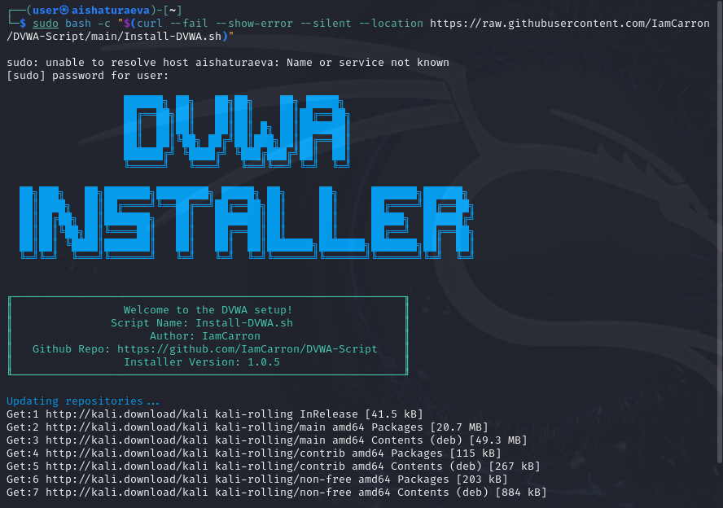
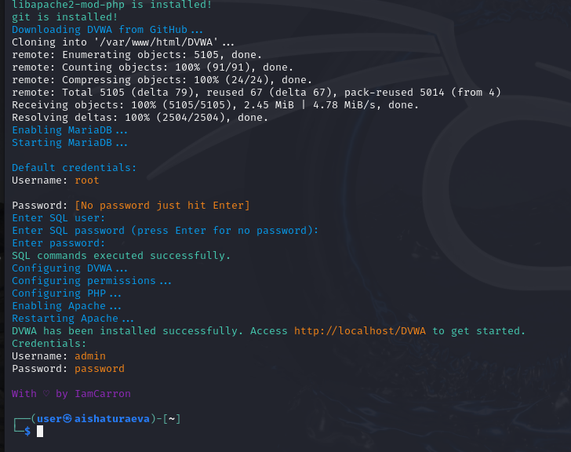
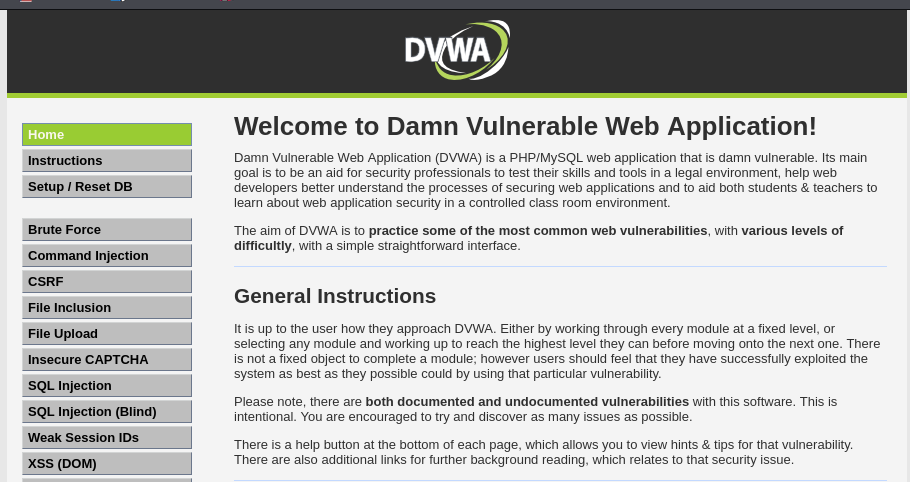

---
## Front matter
lang: ru-RU
title: Индивидуальный проект - этап 2
author: |
	 Аиша Тураева\inst{1}

institute: |
	\inst{1}Российский Университет Дружбы Народов

date: 17 марта, 2025, Москва, Россия

## Formatting
mainfont: PT Serif
romanfont: PT Serif
sansfont: PT Sans
monofont: PT Mono
toc: false
slide_level: 2
theme: metropolis
header-includes: 
 - \metroset{progressbar=frametitle,sectionpage=progressbar,numbering=fraction}
 - '\makeatletter'
 - '\beamer@ignorenonframefalse'
 - '\makeatother'
aspectratio: 43
section-titles: true

---

# Цели и задачи работы

## Цель лабораторной работы

Целью данной работы является изучение задач приложения DVWA и его установка в систему Kali Linux.

# Процесс выполнения лабораторной работы

## Введение

**Damn Vulnerable Web Application** (DVWA) — это веб-приложение на PHP/MySQL, которое чертовски уязвимо. Его главная цель — помочь профессионалам по безопасности протестировать их навыки и инструменты в легальном окружении, помочь веб-разработчикам лучше понять процесс безопасности веб-приложений и помочь и студентам и учителям в изучении безопасности веб-приложений в контролируем окружении аудитории.

## Установка

{ #fig:001 width=70% height=70% }

## Установка

{ #fig:002 width=70% height=70% }

## Проверка

{ #fig:003 width=70% height=70% }

# Выводы по проделанной работе

## Вывод

Мы приобрели знания о приложении DVWA и установили его в ОС.