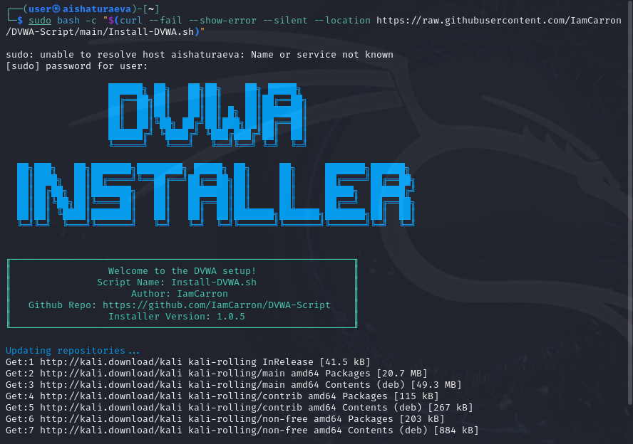
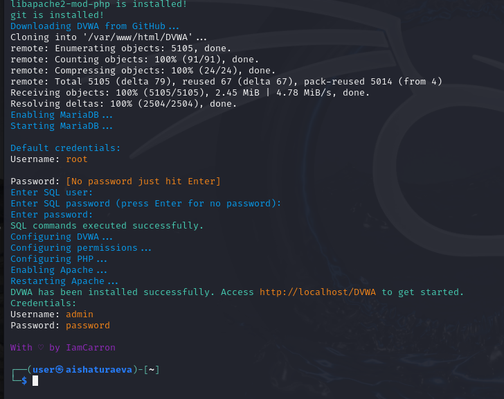
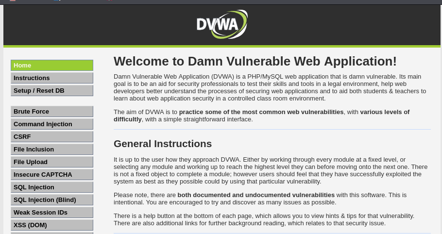

---
# Front matter
lang: ru-RU
title: "Индивидуальный проект - этап 2"
subtitle: "Установка DVWA"
author: "Аиша Тураева"

# Formatting
toc-title: "Содержание"
toc: true # Table of contents
toc_depth: 2
lof: true # List of figures
fontsize: 12pt
linestretch: 1.5
papersize: a4paper
documentclass: scrreprt
polyglossia-lang: russian
polyglossia-otherlangs: english
mainfont: PT Serif
romanfont: PT Serif
sansfont: PT Sans
monofont: PT Mono
mainfontoptions: Ligatures=TeX
romanfontoptions: Ligatures=TeX
sansfontoptions: Ligatures=TeX,Scale=MatchLowercase
monofontoptions: Scale=MatchLowercase
indent: true
pdf-engine: lualatex
header-includes:
  - \linepenalty=10 # the penalty added to the badness of each line within a paragraph (no associated penalty node) Increasing the value makes tex try to have fewer lines in the paragraph.
  - \interlinepenalty=0 # value of the penalty (node) added after each line of a paragraph.
  - \hyphenpenalty=50 # the penalty for line breaking at an automatically inserted hyphen
  - \exhyphenpenalty=50 # the penalty for line breaking at an explicit hyphen
  - \binoppenalty=700 # the penalty for breaking a line at a binary operator
  - \relpenalty=500 # the penalty for breaking a line at a relation
  - \clubpenalty=150 # extra penalty for breaking after first line of a paragraph
  - \widowpenalty=150 # extra penalty for breaking before last line of a paragraph
  - \displaywidowpenalty=50 # extra penalty for breaking before last line before a display math
  - \brokenpenalty=100 # extra penalty for page breaking after a hyphenated line
  - \predisplaypenalty=10000 # penalty for breaking before a display
  - \postdisplaypenalty=0 # penalty for breaking after a display
  - \floatingpenalty = 20000 # penalty for splitting an insertion (can only be split footnote in standard LaTeX)
  - \raggedbottom # or \flushbottom
  - \usepackage{float} # keep figures where there are in the text
  - \floatplacement{figure}{H} # keep figures where there are in the text
---

# Цель работы

Целью данной работы является изучение задач приложения DVWA и его установка в систему Kali Linux.

# Введение

**Damn Vulnerable Web Application** (DVWA) — это веб-приложение на PHP/MySQL, которое чертовски уязвимо. Его главная цель — помочь профессионалам по безопасности протестировать их навыки и инструменты в легальном окружении, помочь веб-разработчикам лучше понять процесс безопасности веб-приложений и помочь и студентам и учителям в изучении безопасности веб-приложений в контролируем окружении аудитории.

Цель DVWA попрактиковаться в некоторых самых распространённых веб-уязвимостях, с различными уровнями сложности, с простым прямолинейном интерфейсом. Обратите внимание, что имеются как задокументированные, так и незадокументированные уязвимости в этом программном обеспечении. Это сделано специально. Вам предлагается попробовать и обнаружить так много уязвимостей, как сможете.

Некоторые из уязвимостей веб-приложений, который содержит DVWA;

* **Брут-форс**: Брут-форс HTTP формы страницы входа; используется для тестирования инструментов по атаке на пароль методом грубой силы и показывает небезопасность слабых паролей.

* **Исполнение** (внедрение) команд: Выполнение команд уровня операционной системы.

* **Межсайтовая подделка запроса (CSRF)**: Позволяет «атакующему» изменить пароль администратора приложений.

* **Внедрение (инклуд) файлов**: Позволяет «атакующему» присоединить удалённые/локальные файлы в веб-приложение.

* **SQL внедрение**: Позволяет «атакующему» внедрить SQL выражения в HTTP из поля ввода, DVWA включает слепое и основанное на ошибке SQL внедрение.

* **Небезопасная выгрузка файлов**: Позволяет «атакующему» выгрузить вредоносные файлы на веб-сервер.

* **Межсайтовый скриптинг (XSS)**: «Атакующий» может внедрить свои скрипты в веб-приложение/базу данных. DVWA включает отражённую и хранимую XSS.

* **Пасхальные яйца**: раскрытие полных путей, обход аутентификации и некоторые другие.

# Выполнение лабораторной работы

Для установки приложения на Debian системы можно воспользоваться командой в одну строку.

```bash

sudo bash -c "$(curl --fail --show-error --silent --location https://raw.githubusercontent.com/IamCarron/DVWA-Script/main/Install-DVWA.sh)"

```

Или же скопировать из репозитория установочный скрипт и запустить его.

Также существует полностью ручной способ установки, но рассматривать его мы не будем.

{ #fig:001 width=70% height=70% }

{ #fig:002 width=70% height=70% }

Далее DVWA работает как локальный сервер и доступно через браузер.

{ #fig:003 width=70% height=70% }

# Вывод

Мы приобрели знания о приложении DVWA и установили его в ОС.